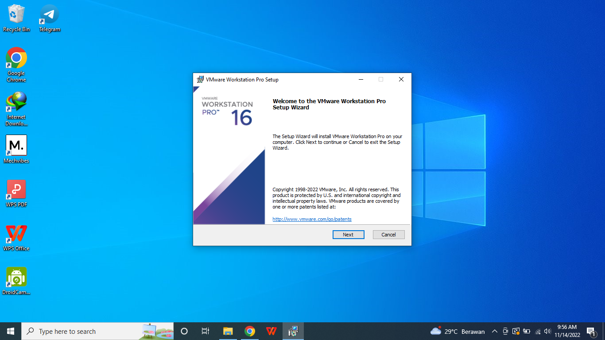
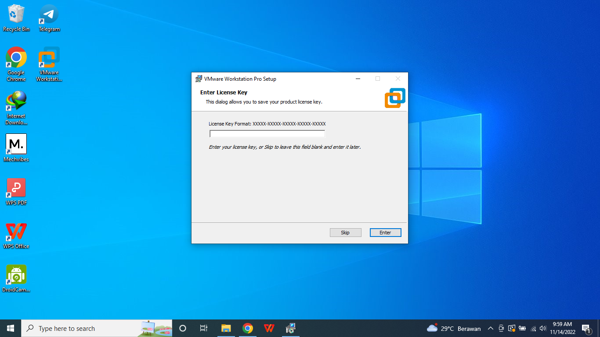
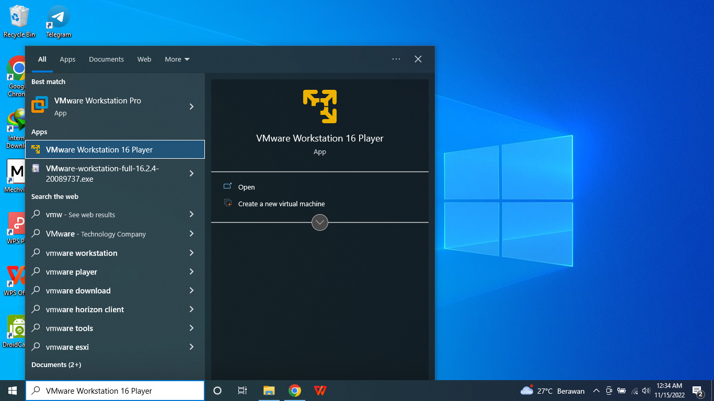
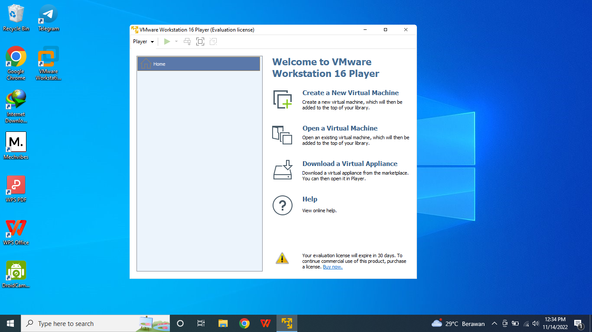
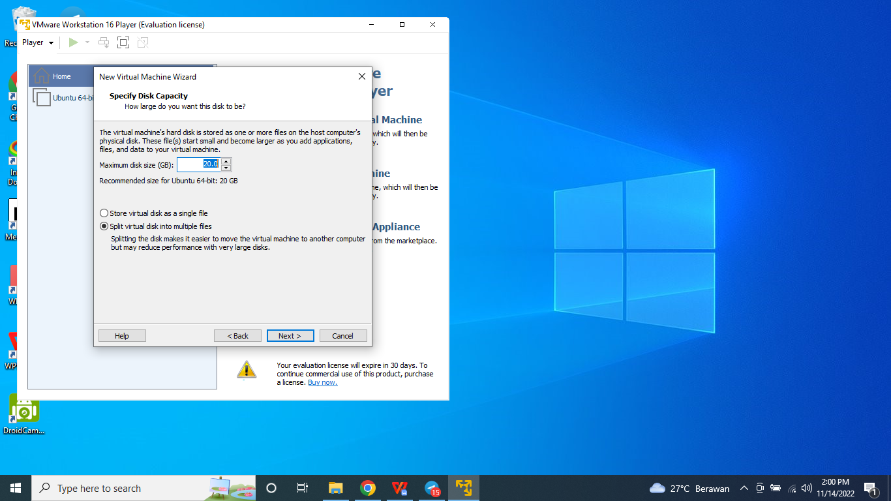
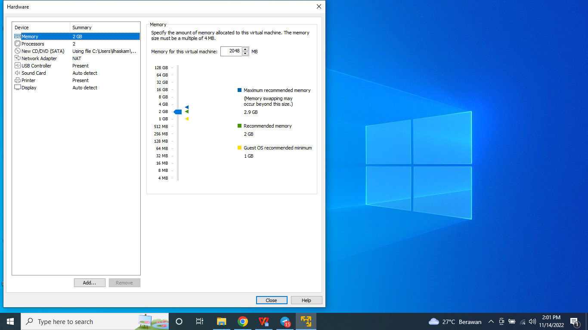
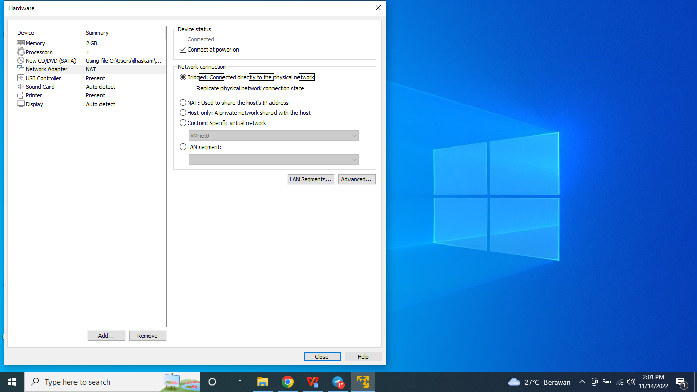
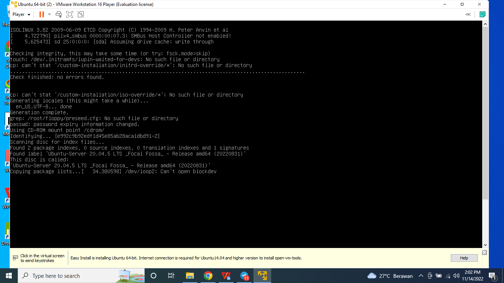

# Task : Introduction to DevOps

### 1. Definisi DevOps

DevOps merupakan singkatan dari dua kata yaitu Development dan Operation.

Di mana kedua kata tersebut bermakna menggabungkan proses development (pengembangan) dari sebuah sistem/aplikasi dengan operation (operasional). bisa dibilang juga bahwa DevOps ini adalah prinsip developer untuk mengkoordinasikan antar tim, yaitu tim development dengan tim operations dengan efektif dan efisien.

### 2. sebutkan lifecycle DevOps (Continuous ...) dan Jelaskan definisi-definisinya!

- Continuous Development: ini melibatkan perencanaan dan pengkodean dalam pengembangan perangkat lunak. Di sini, seluruh proses pengembangan dipecah menjadi siklus pengembangan yang lebih kecil / dipecah - pecah. Proses ini memudahkan tim DevOps untuk mempercepat proses pengembangan perangkat lunak secara keseluruhan

- Continuous integration (CI) adalah langkah-langkah yang berkaitan dengan fase pengujian atau testing. Pada fase ini, Klien juga memberikan informasi yang akan dimasukkan untuk menambahkan fitur baru ke aplikasi. Pada fase ini juga sebagian besar perubahan terjadi pada kode. CI adalah pusat dimana perubahan pada kode yang sering terjadi setiap hari maupun bulan.
Kode yang dibangun ini adalah kombinasi antara Unit Test, Code Review, Integration dan Packaging. Pada fase ini developer sangat sering melakukan perubahan, mereka akan sangat cepat menemukan masalah yang terjadi (jika ada) dan menyelesaikannya pada tahap Continuous Development

### 3. Installasi Ubuntu Server

2 CPU, 2GB RAM & 20GB Storage ( 2GB digunakan utk swap )
setup IP Static
Install OpenSSH server

* #### Kunjungi situs vmware.com seperti gambar dibawah ini. Lalu pilih download for windows atau linux sesuai dengan OS yang digunakan.

* #### Lalu klik Next.

* #### Centang I accept the terms..., lalu Next.

* #### Pilih yang bawah Add VMware Workstation..., lalu Next.

* #### Centang keduanya seperti gambar dibawah ini, lalu Next.

* #### Semisal setelah install ingin memunculkan icon dari VMware bisa centang Desktop, lalu Next

* #### Klik Install.

* #### Proses Installing VMware sedang berjalan.

* #### Semisal mempunyai License, bisa klik License, kalau tidak bisa langsung klik Finish.

* #### Ini tampilan semisal anda ingin memasukkan license key.

* #### Buka Home di windows lalu ketik VMware Workstation Player, jika muncul berarti proses installasi berjalan dengan baik.

* #### Tampilan setelah dibuka VMware Workstation Player. Pilih Create a New Virtual Machine.

* #### Pilih Browse untuk memilih file iso yang akan digunakan. Lalu Next.

* #### Masukkan Fullname, username, dll. Lalu Next.

* #### Klik Next.

* #### Maximum disk size isi 20.0. Lalu pilih Split virtual disk intomultiple files. Lalu Next.

* #### Pilih Customize Hardware.

* #### Memory isikan 2GB.

* #### Processors isikan 1 (Optional) diatas 1 juga gpp sesuai kebutuhan masing-masing.

* #### Network Adapter ubah menjadi bridged.

* #### Klik Finish.

* #### Proses Installasi.

* #### Pilih language English. Lalu tekan Enter.

* #### Pilih Continue without updating.

* #### Pilih English.

* #### Pilih ens33. Lalu tekan Enter.

* #### Pilih edit IPv4. Tekan Enter.

* #### IPv4 method,pilih yang manual.

* #### Masukkan Subtet, IP Address, dll (Sesuai IP dari laptop kita masing-masing). Lalu tekan save.

* #### Untuk proxy server kosongi saja.

* #### Pada tahap ini tidak perlu ada yang diubah.

* #### Pilih custom storage layout.

* #### Setelah itu pilih free space, pilih Add GPT Partition.

* #### Isikan 2G, lalu pilih Format Swap. Lalu tekan Create.

* #### Isikan size max yang tertera, untuk Format pilih ext 4, Lalu tekan Create.

* #### Pastikan partition sudah terbuat, dengan mengecek MOUNT POINT beserta sizenya.

* #### Klik Done.

* #### Klik Continue untuk melanjutkan.

* #### Isikan nama, server name, dll.

* #### Centang Install OpenSSH server.

* #### Klik Done.

* #### Optional pada tahap ini, semisal kalian ingin menginstal aplikasi yang tersedia bisa centang aplikasi yang ingin di install.

* #### Klik Done.

* #### Proses Installing kernel.

* #### Pilih Reboot Now.

* #### Proses Reboot.

* #### Login menggunakan username dan password.

* #### Untuk mengecek koneksi internet, ping dns dari google.

