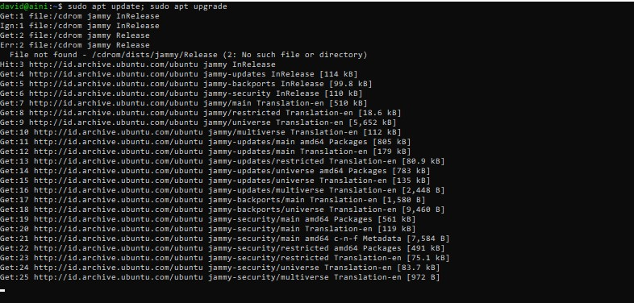
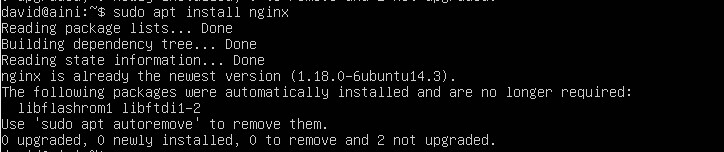
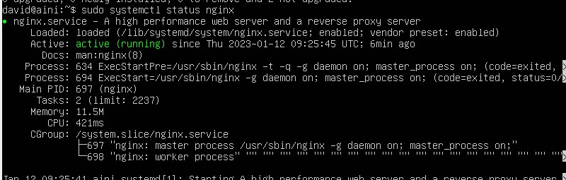
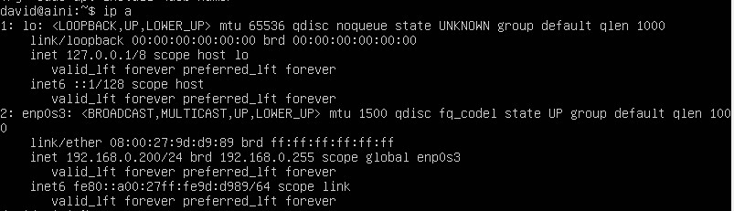
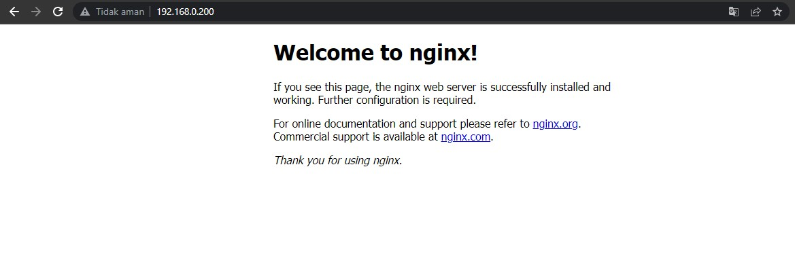

# Task : Linux Shell & Computer Networking

### 1. Perbedaan antara IP private & public

* #### IP public adalah alamat IP yang digunakan dalam jaringan global Internet. Diberikan oleh penyedia layanan internet (ISP) seperti Telkom, My Republik dll.

* #### IP private adalah alamat IP yang digunakan dalam jaringan local dan tidak bisa diakses dari jaringan internet secara langsung. sudah terdapat dalam PC, laptop, dan hp.

### 2. Jelaskan perbedaan Client-to-server & Peer-to-peer

* #### Perbedaan utama antara jaringan Client-Server dan Peer-to-Peer adalah bahwa ada server khusus dan klien tertentu dalam model jaringan klien-server sedangkan, dalam peer-to-peer setiap node dapat bertindak sebagai server dan klien

* #### Dalam model client-server, server memberikan layanan kepada klien. Namun, dalam peer-to-peer, setiap peer dapat menyediakan layanan dan juga dapat meminta layanan.

* ### Dalam model klien-server, berbagi informasi lebih penting sedangkan, dalam konektivitas model peer-to-peer antara rekan-rekan lebih penting.

* ### Dalam model client-server, data disimpan pada server terpusat sedangkan, dalam peer-to-peer masing - masing peer memiliki data sendiri

* ### Dalam model peer-to-peer, server didistribusikan dalam suatu sistem, sehingga ada kemungkinan lebih sedikit server mengalami kemacetan, tetapi dalam model client-server, ada satu server yang melayani klien, sehingga ada lebih banyak peluang server mengalami kemacetan

### 3. Jalankan nginx di server kalian

* #### Untuk melakukan update dan upgrade, kalian bisa menggunakan perintah di bawah ini.

* #### Selanjutnya kita akan coba untuk menginstall aplikasi Nginx. Kalian bisa gunakan perintah di bawah ini.

* #### Jika instalasi sudah selesai kita bisa cek dengan menggunakan perintah dibawah ini.

* #### Cek ip dari server di linux menggunakan command ifconfig.

* #### Buka browser dan masukkan ip dari server.

### 4. Cari 3 command shell yang belum di present dan berikan definisinya

* ### diff command
diff adalah perintah dasar Linux yang membandingkan konten atau isi dua file berdasarkan baris demi baris. Setelah menganalisis file, perintah ini akan menghasilkan output berupa line atau baris yang tidak cocok. Programmer sering menggunakan command ini ketika mereka perlu membuat perubahan program, alih-alih menulis kembali semua kode source.

* ### top command
Sebagai terminal yang setara dengan Task Manager di Windows, command top akan menampilkan daftar proses yang sedang berlangsung dan seberapa banyak ruang CPU yang digunakan oleh tiap proses tersebut. Melakukan pengawasan terhadap penggunaan resource sistem sangatlah disarankan, terutama ketika Anda harus mencari tahu mana proses yang perlu dimatikan karena terlalu banyak menggunakan resource.

* ### head command
Perintah head digunakan untuk melihat baris pertama dari semua file teks. Secara default, perintah ini akan menampilkan sepuluh baris pertama. Namun, jumlah baris tersebut dapat diubah sesuai keinginan Anda
