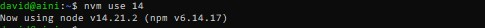
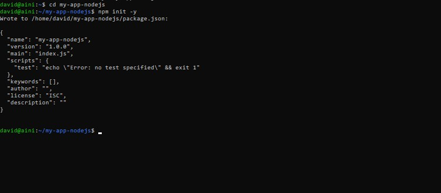
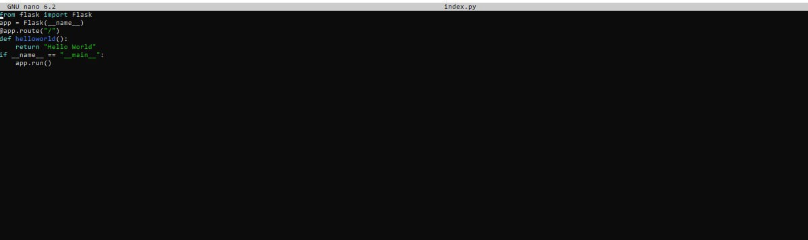
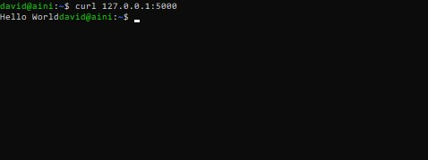

# Task : Application in Server

## 1. Menjalankan aplikasi Webserver (nginx/apache2)

* #### Buka browser dan masukkan ip dari server.

## 2. Menjalankan 3 aplikasi "hello world" menggunakan nodejs, golang dan python

### nodejs
Pertama-tama kita harus meng-install terlebih engine-nya dahulu. Untuk instalasi kalian bisa menggunakan beberapa perintah dibawah ini.

keterangan : disini kita menggunakan nvm

nvm merupakan singkatan dari Node Version Manager. nvm adalah sebuah program yang akan membantu kita untuk menggunakan lebih dari satu versi Nodejs di dalam satu komputer..

keterangan : Jika nvm belum terdeteksi gunakan perintah di atas ini

keterangan : perintah di atas berguna untuk menginstall node.js dengan versi 16. Jika kalian ingin menggunakan node.js denganversion 14, maka Jalankan perintah nvm install 14.

keterangan : Untuk menggunakan node.js dengan versi 16

Jika tahapan di atas sudah kalian lakukan, maka kalian sudah berhasil untuk melakukan instalasi node.js. Untuk melakukan pengecekan kalian bisa menggunakan perintah di bawah ini.

Selanjutnya kita akan menjalankan perintah npm init gunanya untuk mengisiasi project, Hasil dari kalian menjalankan perintah akan membuat file baru dengan nama package.json, package.json ini berisikan isi informasi dari aplikasi yang akan kalian buat.

mkdir my-app-nodejs

Selanjutnya kita akan menginstall Express JS. Express JS adalah framework dari NodeJS yang dirancang secara fleksibel dan sederhana untuk membantu tahap pengembangan aplikasi back end. Menginstall express js dapat dilakukan menggunakan NPM dengan perintah berikut:

Jika sudah buat file dengan nama index.js, lalu masukan script dibawah ini

nano index.js

Jika sudah sekarang kita akan coba untuk menjalankan aplikasi sederhana yang sudah kita buat. Untuk menjalankan dapat menggunakan perintah berikut ini.

keterangan : untuk keluar bisa menggunakan CTRL + X

Sekarang coba akses web browser kalian setelah itu kalian coba akses dengan ip server:3000 dan jika dilokal coba akses dengan localhost:3000

### golang
Pertama-tama sama seperti sebelumnya, kita harus mendownload engine-nya terlebih dahulu.

Selanjutnya masukkan path go pada .bashrc

Jika sudah sekarang dapat verifikasi go dengan cara berikut.

Sekarang kita akan membuat aplikasi sederhana menggunakan go. Kalian dapat menjalankan beberapa perintah berikut ini.

Setelah itu masukkan script dibawah ini.

Sekarang jalankan aplikasi go dengan menggunakan perintah berikut.

### python
Pertama-tama kita harus install terlebih dahulu Pyhton3. Untuk instalasi ikuti beberapa perintah di bawah ini.

Python3 sudah ada secara default, untuk melakukan pengecekan jalankan perintah berikut.

Sekarang kita install package manager dari python3. Kalian dapat menggunakan perintah berikut ini.

Jika sudah sekarang jalankan aplikasi dengan menggunakan perintah berikut ini.

Sekarang coba akses web browser kalian setelah itu kalian coba akses dengan curl 127.0.0.1:5000

keterangan : untuk case ini karena gak bisa melakukan localhost dibrowser jika python akan tetapi aksesnya dicli ubuntu server dengan curl 127.0.0.1:5000

## 3. Gunakan localtunnel untuk menjalankan "Hello world!" nodejs

