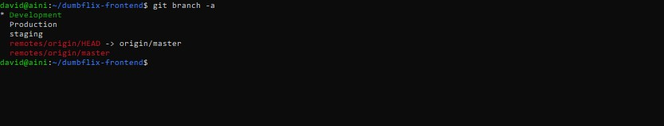

# Task : Version Control System

## 1. Jelaskan definisi distributed revision control!
Git juga biasa dikenal dengan istilah Distributed Revision Control (VCS Terdistribusi), maksudnya adalah tempat penyimpanan atau database Git tidak hanya berada di satu tempat saja, melainkan terdistribusi atau tersimpan di tempat lain juga.
Semua orang yang berhubungan di dalam proses pengkodean pengembangan perangkat lunak juga menyimpan database Git, hal ini memudahkan setiap programmer atau orang untuk mengelola proyek ketika offline ataupun online, ada atau tidaknya internet tidak menjadi masalah jika menggunakan Git, karena database Git juga ada pada local komputer kita.
Ketika terhubung dengan internet kita dapat menggabungkan kode atau file yang kita buat dengan pengguna lainnya, jadi tidak perlu repot-repot menggabungkan satu satu

## 2. Buat repository untuk tugas kalian di github dengan format dumbways-devops15-nama kalian

## 3. Hubungkan ssh public key ke akun github

## 4. Clone repository dumbflix-frontend & buat 3 branch (Development, Staging & Production)

### Repository : https://github.com/dumbwaysdev/wayshub-frontend
### Ebook : https://ebook-devops.vercel.app/Fundamental-DevOps/Fundamental-DevOps
