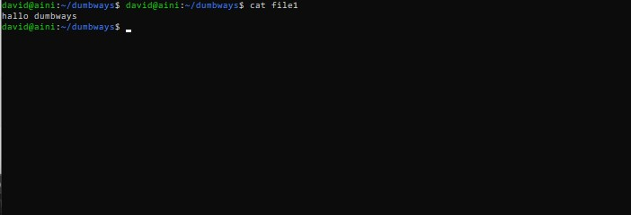
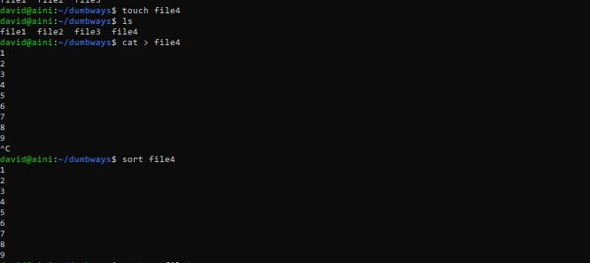
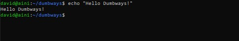

# Task : Manage Server with Terminal

## 1. Apa itu terminal
Terminal adalah interface di mana Anda bisa mengetikkan baris-baris perintah berbasis teks untuk sistem operasi Linux. Biasanya, sebutan lain terminal adalah Shell. Jika Anda familiar dengan OS Windows, Terminal pada Linux memiliki fungsi yang mirip dengan CMD (Command Prompt). 
Terminal memungkinkan pengguna komputer untuk menjalankan berbagai fungsi pada komputer melalui baris-baris perintah. Walaupun saat ini kebanyakan sistem operasi sudah memiliki tampilan grafis, tapi hal itu terkadang belum cukup. Ada beberapa fungsi yang hanya dapat Anda jalankan dengan baris perintah, di sinilah peran Terminal dalam membantu Anda. 

## 2. BASH script untuk update dan upgrade server, lalu install nginx/apache2

* #### Pertama lihat list di dalam ubuntu kita

* #### Ketik nano (nama_file) pada kasus saya ini saya buat nama file update_upgrade_server.sh. Lalu masukkan perintah untuk update dan upgrade server juga install nginx di ubuntu.

* #### Jika sudah tersimpan pada list direktori akan terbuat file update_upgrade_server.sh..

* #### Untuk menjalankan bash script di ubuntu server gunakan perintah sh nama_file (update_upgrade_server.sh). Maka proses akan dilakukan secara otomatis oleh server kita.

## 3. BASH script untuk memberi akses ke port 22,80,443
* #### Untuk memberikan akses port kita harus mengecek dahulu apakah settingan firewall diubuntu server kita sudah active atau belum dengan perintah sudo ufw status. Maka akan muncul tulisan active atau inactive.

* #### Buat file untuk menjalankan bash script. Pada kasus ini saya beri nama allow_22_80_443.sh..

* #### Masukkan perintah sudo ufw allow (port_yang_di_allow) pada file allow_22_80_443.sh. sudo ufw allow bertujuan untuk memberikan akses untuk port 22, 80, dan 443 untuk bisa diakses dari luar server ubuntu kita

* #### Untuk memastikan bahwa perintah yang kita jalankan nantinya bisa berjalan dengan lancar. Coba cek ulang perintah yang kita masukkan di file allow_22_80_443.sh. Dengan perintah cat allow_22_80_443.sh

* #### Pertama coba terlebih dahulu untuk ssh ke server ubuntu kita melalui cmd. Maka akan muncul pesan error pada saat kita mau akses melalui ssh, dikarenakan pada server ubuntu kita belum memberikan akses port 22 untuk diakses melalui luar server dari ubuntu kita

* #### Untuk menkalankan perintah bash script cukup dengan sh nama_file (allow_22_80_443.sh). Maka akan muncul tulisan "Rule added" yang artinya memberikan akses port kita untuk diakses dari luar server ubuntu sudah berhasil

* #### Untuk mengeceknya apakah sudah berhasil atau belum, bisa kita coba untuk ssh di ubuntu server kita. Jika sudah berhasil untuk mengakses server ubuntu melalui ssh. Berarti akses port dari luar server ubuntu sudah berhasil

## 4. Tugas text manipulation

* ### - contoh penggunaan cat, grep, echo & sort
* ### - mengganti text 'Dumbways' ke 'Bootcamp'

1. Cat 

* ### cat (file-name)

keterangan : untuk melihat isi dari suatu file

* ### cat > (file-name)

keterangan : untuk membuat suatu file baru serta memasukkan teks, Jika sudah menambakan teks kalian dapat keluar dengan klik CTRL + C.

* ### cat file1 file2 > file3

keterangan : untuk menggabungkan dua buah file, dan menyimpannya ke dalam file3

2. Send 

* ### sed -i 's/hallo dumbways/Bootcamp/g' file3

keterangan : mengganti semua kata hallo dumbways menjadi Bootcamp pada file3

3. Grep

* ### grep Bootcamp file3

keterangan : akan mencari kata Bootcamp pada file3

* ### grep -c Bootcamp file3

keterangan : akan menghitung jumlah kata “Bootcamp” pada filetiga

* ### grep Bootcamp *

keterangan : akan mencari semua file yang berisikan kata Bootcamp

4. Echo & Short

* ### sort file4

keterangan : untuk mengurutkan berdasarkan ascending

* ### sort -r file4

keterangan : untuk mengurutkan berdasarkan descending

* ### echo "Hello Dumbways!"

keterangan : untuk mencetak string **

* ### echo "Hello Dumbways!" >> file3

keterangan : untuk mencetak kata Hello Dumbways! di file

* ### echo "Replace semua data" > file5

keterangan : untuk mereplace semua data di file5 dan menggantinya dengan "Replace semua data"

## 4. Gunakan nmon untuk tampilkan CPU usage, RAM usage, Disk dan Resources OS & Proc

