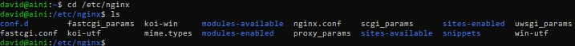

# Task : web server dan load balancing

### 1. Definisi Web Server
- Web Server adalah sebuah software yang memberikan layanan berupa data. Berfungsi untuk menerima permintaan HTTP atau HTTPS dari client atau di kenal dengan web browser (chrome atau firefox). Kemudian web server akan mengirimkan respon atas permintaan tersebut dalam bentuk halaman web.

## 2. Jalankan 2 VM (Optional)
 - VM 1 = appserver
 - VM 2 = nginx *
 
 ## 3. VM 2 :
 ### 3.1 Membuat Konfigurasi Revese Proxy
 
 
 
 
 
 
 
 
 
 
 
 
 
 
 
 
  ### 3.2 Membuat Konfigurasi Load Balancing
 
 
 
 
 
 

### Dumbflix-frontend : https://github.com/dumbwaysdev/dumbflix-frontend
### Ebook Dumbways Devops : https://ebook-devops.vercel.app/Web-Server-and-Load-Balancing/Load-Balancing
